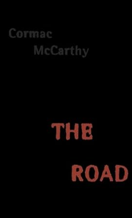

# Books that I have presented

  <!-- Lewa kolumna: tytuł -->
  

    <h3 style="margin: 0;">"Brave New World Revisited" by Aldous Huxley</h3>
    <h6 style="margin: 0;">totalitarianism, propaganda, globalism</h6>
  

  <!-- Środkowa kolumna: okładka -->
  

    
  

  <!-- Prawa kolumna: linki -->
  

    <a href="https://www.youtube.com/watch?v=iyqHwpR7As8" 
       target="_blank"
       class="md-button md-button--primary"
       style="padding: 2px 4px; font-size: 0.5rem;">
       YouTube
    </a>

    <a href="https://open.spotify.com/episode/2UkeD6hsYipeqAenQyvop8?si=9b8712fd79c14091" 
       target="_blank"
       class="md-button md-button--primary"
       style="padding: 2px 4px; font-size: 0.5rem;">
       Spotify
    </a>

    <a href="https://amzn.eu/d/1f9Bk0Z"
       target="_blank"
       class="md-button md-button--primary"
       style="padding: 2px 4px; font-size: 0.5rem;">
       Amazon
    </a>

    <a href="https://linktr.ee/w.salski"
       target="_blank"
       class="md-button md-button--primary"
       style="padding: 2px 4px; font-size: 0.5rem;">
       Support
    </a>

  

  <!-- Lewa kolumna: tytuł -->
  

    <h3 style="margin: 0;">"The Road" by Cormac McCarthy</h3>
    <h6 style="margin: 0;">apocalypse, destruction, society</h6>
  

  <!-- Środkowa kolumna: okładka -->
  

    
  

  <!-- Prawa kolumna: linki -->
  

    <a href="https://www.youtube.com/watch?v=conm-HLtFOI" 
       target="_blank"
       class="md-button md-button--primary"
       style="padding: 2px 4px; font-size: 0.5rem;">
       Youtube
    </a>

    <a href="https://open.spotify.com/episode/1IWBAsunhlNkUl1oHoighc?si=e553a9edb892446a" 
       target="_blank"
       class="md-button md-button--primary"
       style="padding: 2px 4px; font-size: 0.5rem;">
       Spotify
    </a>

    <a href="https://amzn.eu/d/ebyUm2o"
       target="_blank"
       class="md-button md-button--primary"
       style="padding: 2px 4px; font-size: 0.5rem;">
       Amazon
    </a>

    <a href="https://linktr.ee/w.salski"
       target="_blank"
       class="md-button md-button--primary"
       style="padding: 2px 4px; font-size: 0.5rem;">
       Support
    </a>

  

</script>
