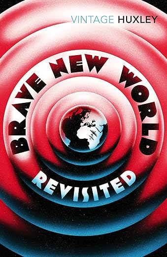

# "Brave New World Revisited" by Aldus Huxley

In this week’s episode, we dive into Aldous Huxley’s Brave New World: Revisited, exploring his prescient warnings about the dangers of over-organization and centralized power in shaping a controlled society. 

We examine how propaganda and the manipulative art of selling brainwash populations, eroding critical thought and fostering compliance. 
We’ll discuss how understanding Huxley’s reflections empowers us to recognize and resist modern forms of manipulation, from media narratives to consumerist conditioning. 

Additionally, we uncover his critique of chemical persuasion, revealing how a dulled, “stupid” society becomes easier to control through substances and distractions. 

Join us to discover how Huxley’s insights remain a vital guide for safeguarding freedom and intellectual integrity against the subtle threats of centralized control and persuasion. 

Tune in for a thought-provoking discussion that connects Brave New World: Revisited’s lessons to today’s challenges and the enduring fight for an awakened, autonomous humanity.

I trust that this episode, will prove beneficial to you, your loved ones, and the broader world. As always, I will be sharing several thought-provoking concepts for you to ponder and apply in real-life scenarios in the upcoming days. For those feeling adventurous, there will also be a challenge awaiting your participation!

All the love, all the power, all of the time!

<a href="https://www.youtube.com/watch?v=iyqHwpR7As8" target="_blank" class="md-button md-button--primary">Listen to  the podcast</a>
<a href="https://amzn.eu/d/1f9Bk0Ztarget="
target="_blank" class="md-button md-button--primary">See the book on Amazon</a>

</script>
