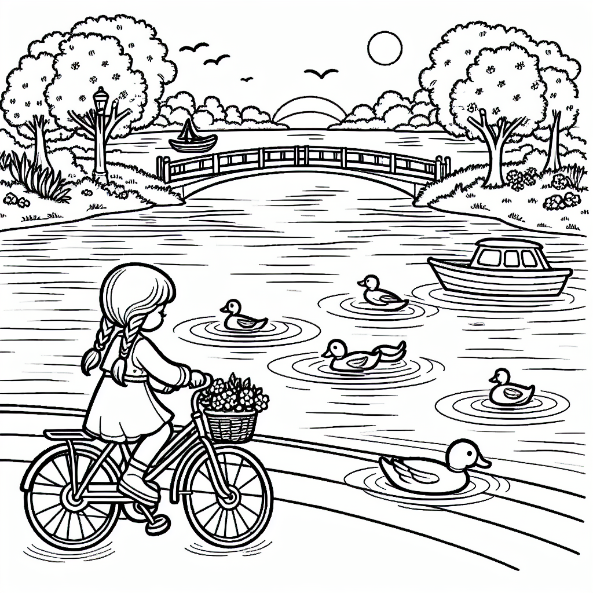

# Aplikacja do tworzenia kolorowanek

Przy pomocy tej aplikacji można tworzyć obrazki do kolorowania (dla dzieci i dorosłych) o treści dostosowanej do intywidualnych oczekiwań użytkownika. Zapraszam do zabawy.

<a href="https://kolorowanki-hbzvd.ondigitalocean.app/" target="_blank" class="md-button md-button--primary">Uruchom aplikację</a>
<a href="app.py" class="md-button md-button--primary">Pobierz Notebook</a>

</script>
