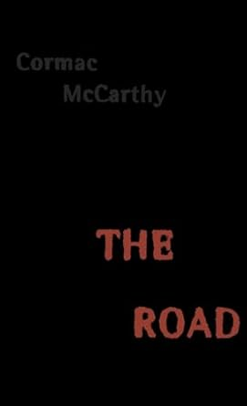

# "The Road" by Cormac McCarthy

In this week’s episode, we dive into Cormac McCarthy’s 'The Road', exploring the vital role of self-reliance in a post-apocalyptic world stripped of civilization. 

We examine how the dangers of anarchy unleash chaos and savagery, revealing the fragility of societal order and the underappreciated value of a structured world. We’ll discuss how trust, though fragile, becomes essential for building relationships and fostering hope for a new society, even amidst despair. 

Additionally, we uncover the novel’s call for gratitude, highlighting how appreciating life’s smallest moments sustains humanity in the face of desolation. Join us to discover how The Road’s haunting vision remains a powerful guide for cultivating resilience, trust, and gratitude against the threats of chaos and loss. 

I trust that this episode, will prove beneficial to you, your loved ones, and the broader world. As always, I will be sharing several thought-provoking concepts for you to ponder and apply in real-life scenarios in the upcoming days. For those feeling adventurous, there will also be a challenge awaiting your participation!

All the love, all the power, all of the time!

<a href="https://www.youtube.com/watch?v=conm-HLtFOI" target="_blank" class="md-button md-button--primary">Listen to  the podcast</a>
<a href="https://amzn.eu/d/ebyUm2o"
target="_blank" class="md-button md-button--primary">See the book on Amazon</a>
<a href="https://linktr.ee/w.salski"
target="_blank" class="md-button md-button--primary">Support the podcast</a>

</script>
